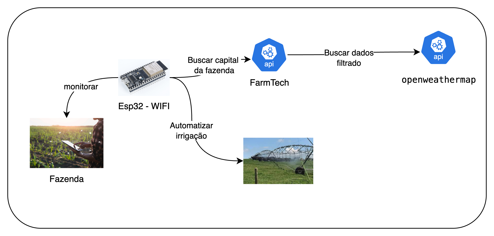
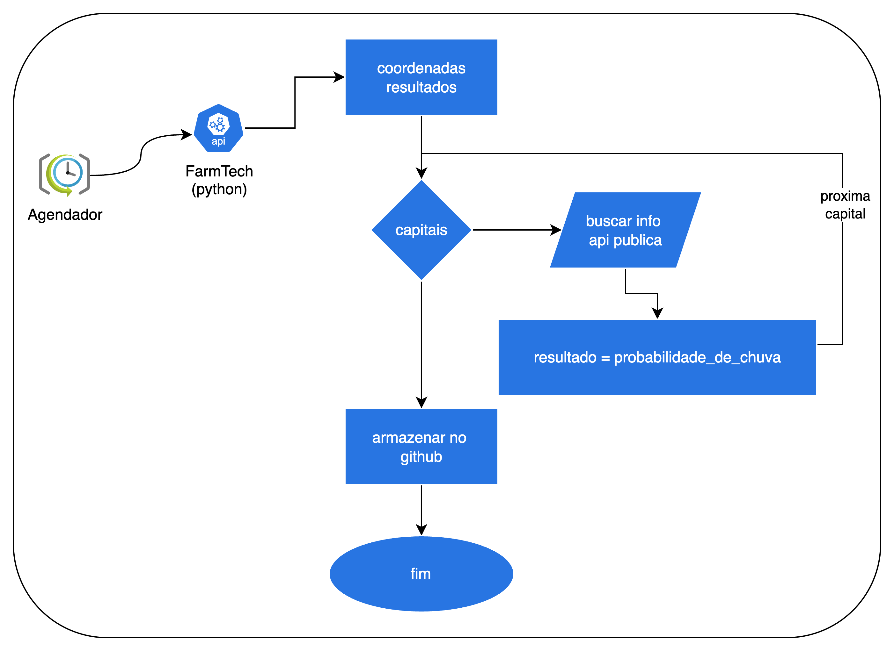

<h1>FIAP - Faculdade de Informática e Administração Paulista</h1>

 

# Projeto FarmTech Solutions: Otimizador de irrgação de cultivo para café

## 👨‍🎓 Integrantes:

- <a href="https://www.linkedin.com/in/cauanotto">CAUAN OTTO RODRIGUES SOUSA (RM567940)</a>
- <a href="https://www.linkedin.com/in/fernando-gurgel-75aa8369">FERNANDO ARAUJO GURGEL (RM567606)</a>
- <a href="https://www.linkedin.com/in/iraci-souza-bab42034">IRACI MONTEIRO SOUZA (RM567544)</a> 
- <a href="https://www.linkedin.com/in/malu-rodrigues-bb756b271">MARIA LUISA RODRIGUES NASCIMENTO (RM567659)</a> 
- <a href="https://www.linkedin.com/in/rafaela-torres222">RAFAELA TORRES MARTINS (RM567735)</a>

## 👩‍🏫 Professores:
**Tutor(a):** [ANA CRISTINA DOS SANTOS](https://www.linkedin.com/company/inova-fusca)  
**Coordenador(a):** [ANDRÉ GODOI](https://www.linkedin.com/in/andregodoichiovato)

---
## Descrição do projeto

Este projeto permite ver aplicação do conhecimentos em sensoriamento, loT e consulta de APl. Além disso, tem visão prático do uso da loT e da IA para otimização de recursos em um ambiente agrícola.
Essa integração é fundamental para o sucesso da nossa startup FarmTech Solutions, e também para o projeto de uma fazenda inteligente, garantindo que a água seja utilizada de forma eficiente, reduzindo desperdícios e maximizando a produtividade agrícola.

## Diagrama de comunicação

## Diagrama da API 

## Esquema eletricos

## Link Wokwi
<a href="https://wokwi.com/projects/444116318159382529"> wokwi </href>

## Link YouTube

